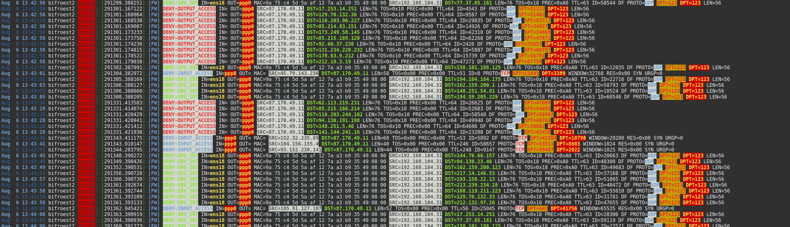

# 🛡️ bifroest – Ein modulares Firewall-Skript für iptables

* 🇬🇧  [English Translation](doc/EN/readme.md)

`bifroest2` ist ein robustes, einfach verständliches und modular aufgebautes Firewall-Framework auf Basis von `iptables`. Es richtet sich an Admins und Power-User, die klare, nachvollziehbare Regeln für IPv4-Netzwerke brauchen – ohne Blackbox und ohne komplexe Tools wie `firewalld` oder `nftables`. "What You See Is What You Get" - WYSIWYG - ohne zusätzlichen kunterbunten Schnick-Schnack, also einfach Firewall. ;o)

Ich habe das Script inzwischen seit 2006 in Verwendung, auf den verschiedensten Systemen und bei vielen Firmen, mit vielen Administratoren. Bisher hat sich jeder in den Aufbau und die Funktionsweise problemlos einarbeiten können, da alle Firewallregeln übersichtlich gestaltet sind und von nichts ablenken. Es ist eindeutig zu sehen, welche Regel welche Aufgaben zu erfüllen hat. Es ist einfach nur eine Firewall, ohne jede Ablenkung vom wesentlichen.

---

## 🔍 Warum bifroest2?

- ✅ **Modularer Aufbau** – Regeln in separaten, einfach zu wartenden Shell-Skripten (`rules-enabled/*.sh`)
- 🔄 **Fehlertolerant** – Syntaxfehler in einzelnen Regeldateien verhindern nicht das Laden anderer Regeln
- 🔒 **Sicher gegen Lockouts** – keine Übernahme fehlerhafter Regeln
- 🧱 **Strukturierte Chains pro Objekt/Zone** – z. B. `ALEX`, `GAST`, `IOT`
- 📜 **Lesbares Logging** und saubere Trennung von Regeltyp & Zielsystem
- 🧠 **Leicht verständlich** – ideal zum Lernen oder für den produktiven Einsatz in kleinen bis mittleren Netzwerken. Es kann aber auch "ganz groß"!
- 📊 **Grafische Auswertung** – Influxdb2 und Grafana werten für dich aus und zeigen die Vorgänge der letzten Zeit an
- 🖧 **Internet-Router** – Routing von und in das Internet mit einfachen Regeln
- 🖥️ **Webserver** – Sichert deinen Web- oder jeden anderen Server perfekt (verhindert DDOS, flooding usw.)

---

## 📦 grundlegender Aufbau

```bash
.
├── setup             # Scriptdateien für Grafana und Co.
├── main/
│   ├── init.sh       # Setzt Interfaces, Defaults, vorbereitet iptables
│   └── ende.sh       # Verarbeitet Regel-Arrays, beendet Skript
├── rules-enabled/
│   ├── 01-alex.sh    # Regel für Alex’ Geräte
│   ├── 02-iot.sh     # Regel für IoT-Netz
│   ├── 98-input.sh   # main rule
│   ├── 99-output.sh  # main rule
│   ├── 99-spezial.sh # main rule
│   └── ...           # Weitere objektbasierte Regeldateien
├── firewall.sh       # Startet den gesamten Regelaufbau
└── README.md
```

---

## 🚀 Schnellstart

```bash
git clone https://github.com/Wutze/bifroest2.git
cd bifroest2
bash ./setup.firewall.sh
sudo ./firewall.sh start
```

**Hinweis:** `iptables` muss vorher installiert und aktiv sein. Das System sollte **IPv4-only** sein und `nftables` muss deaktiviert sein. (`systemctl disable nftables`) Getestet wurde das Script mit seiner neuen Veröffentlichung als bifroest2 auf einem nackten Debian 12 mit 2 Netzwerkkarten.

---

## ✍️ Beispiel-Regeldatei: `rules-enabled/01-alex.sh`

```bash
rulename="ALEX"
count=$(( $count + 1 ))
forwardrule[$count]="$rulename"

$FW -N $rulename

current_object_s[$count]="10.10.10.0/24"
current_object_d[$count]="0.0.0.0/0"

$FW -A $rulename -i $DEV_INTERN -o $DEV_EXTERN -s 10.10.10.61 -p tcp --dport 80 -j ACCEPT

# $FW -> wie angegeben in der firewall.conf - iptables
# -A -> weise zu Regelset
# $rulename -> Name des Regelsets, welches in der Datei (hier "Alex") angegeben sein muss
# -i -> Input-Device
# $DEV_INTERN -> wie angegeben ind er firewall.conf, das Interne Netzwerk-Device
# -o -> Output-Device
# $DEV_EXTERN -> das Netzwerkgerät, auf welchem die Daten ausgehen sollen (meist ppp0)
# -s -> Source, also "woher kommen die Pakete"
# 10.10.10.61 -> woher genau kommen die Pakete, hier die IP-Adresse
# -p -> Protokoll, TCP oder UDP
# tcp -> siehe Zeile darüber
# --dport -> Der Ziel-Port
# 80 -> als Zielport ist Port 80 angegeben, also hier der Zugriff auf einen Webserver ohne SSL
# -j ACCEPT -> Akzeptiere diese Regel genau so. Statt ACCEPT kann auch DROP eingetragen werden, das würde speziell hierfür die Kommunikation mit allen Webservern blockieren

# Weitere spezifische Regeln für DNS, ICMP etc.
```

---

## 📚 Hinweise

- **Keine festen Includes nötig** – Regeln werden dynamisch mit Bash geladen
- **Nur gültige Regeln werden verarbeitet**, andere übersprungen
- Skripte sind klar dokumentiert und leicht nachvollziehbar
- Das Script "setup.firewall.sh" legt automatisch alle Variablen so an, dass nur das Interne Device per SSH erreichbar ist! Vorausgesetzt du legst die richtigen Netzwerkschnittstellen während des Setups fest. Mindestens zwei Netzwerkkarten sind notwendig. Das Script lässt auch wesentlich mehr zu. Du kannst auch merhere verschiedene Variablen anlgenen, zu ein und derselben Netzwerkschnittstelle.

Beispiel:

eth1 kann $DEV_INTERN sein, jedoch auch $DEV_VLAN, $DEV_INPUT usw. So kannst du neue Variablen anlegen, die immer beschreiben welche Aufgabe sie haben sollen. Das macht das auffinden von Fehlern oder das Verständnis der Inhalte der Dateien, bei komplexen Firewalls, einfacher.

---

## ❤️ Lizenz & Mitmachen

`bifroest2` steht unter der [EUPL](LICENSE). Pull Requests und Feedback sind willkommen!

## Installation

Das Firewallscript am besten nach ``` /opt/firewall/ ``` kopieren

git clone

```
cd /opt/
git clone https://github.com/Wutze/bifroest2
cd bifroest2

```

### Konfiguration

Die Konfiguration findest du nach dem Setup in der ``` firewall.conf ```

- ``` firewall.conf ```
Nicht jeder wird so viele Schnittstellen auf dem Router haben. Deswegen kann man die entsprechenden und nicht benutzten Variablen auch löschen, sie sind nicht unbedingt notwendig, wenn die Schnittstellen nicht vorhanden sind. Sie dienen hier lediglich als Beispiel.

```
## per Default alles offen oder alles zu?!
DEFAULT_STATUS="DROP" 
#DEFAULT_STATUS="ACCEPT" 

## Schnittstellen definieren 
DEV_INTERN="eth1" 
DEV_EXTERN="ppp0" 
```

Auch die im weiteren angegebenen Netzwerke, Ports usw. sind oft nur dann von Interesse, wenn man sehr viele Clients im eigenen Netzwerk betreibt. Ebenfalls können die Namen der Variablen so angepasst werden, so dass man sich selbst eigene Namenskonventionen entwickelt, die man sich auch merken kann.

### Benutzung der Firewall, Starten, Stoppen usw

- Mit dem Aufruf ``` ./firewall help ``` wird Dir der Hilfetext angezeigt.
- Die Firewall selbst kann dann mit ``` ./firewall start ``` oder ``` ./firewall stop ``` gestartet oder gestoppt werden.
- ``` ./firewall backup ``` erstellt ein Backup der funktionierenden Firewall derzeit nach ``` /tmp/ ```
- ``` ./firewall restore ``` spielt das Backup zurück. Ist die Firewall vorher nicht aktiv gewesen, nach dem Restore wird sie es sein.
- ``` ./firewall debug 1 ``` schaltet das erweiterte Logging in die ``` /var/log/syslog ``` ein. Im Normalfall sind die Einträge, die die Firewall tätigt, auf 3 Meldungen begrenzt, da sonst das Logfile zu groß werden würde.
- ``` ./firewall debug 0 ``` schaltet das Logging wieder in den Normalszustand zurück.

### Hinweis

Der Einfachheit halber werden die Firewallregeln mit jedem Funktionsaufruf vollständig gelöscht und neu aufgebaut. Falls jemand die Zugriffe auf diverse Regeln, z.B. mit collectd, loggen möchte, dann wird das nicht ohne weiteres funktionieren. Deswegen auch die Lösung mit influxdb2 und Grafana.

## Wichtige Regelsets und neuanlegen von Regeln

### Default Rulesets

Die Default Regelsets findest du als Link im Ordner rules-enabled. Sie sind bezeichnet als ``` 98-input.sh ``` und  ``` 99-output.sh ``` und dürfen nicht gelöscht werden. Die Ziffern vor den Links zum Dateinamen sind notwendig und werden in genau dieser Reihenfolge abgearbeitet. Es sollte keine Datei mit Nummern oberhalb 98 angelegt werden. Es sei den Du weißt genau was Du tust. Außerdem werden diese beiden Regelsets direkt in die Firewall eingetragen, da sie nur für OUTPUT und INPUT auf dem Router stehen. Alle weiteren Regeln definieren die anderen Dateien, die den Zugriff der Netzwerk-Clients regeln.

Die hier mitgelieferte input.sh lässt jegliche Kommunikation aus den internen Netzwerken mit dem Router zu. Du musst sie also so anpassen, dass nur die Kommunikation erlaubt ist, die tatsächlich erlaubt sein soll. Denn denke daran, die meisten Hackerangriffe passieren meist aus dem internen Netzwerk!

Die output.sh ist hier schon etwas feiner justiert. Sie definiert, wohin der Router Antworten liefern bzw. welche Kommunikation er selbst aufbauen darf.

Damit sollten die Regeln für den Router klar sein.

### Network-Rulesets

Es sind einige Beispiel-Regelsets unter ``` rules-available/ ``` enthalten. Jedes zeigt verschiedene Variationen und sollte daher aus sich heraus selbsterklärend sein.

## Debugging

Es gibt zwei verschiedene Debugging Lösungen.

1. Debug der Regelsets
2. Debug des Firewall-Scripts

### Debug Rulesets

Steuern lässt sich das Debugging der Regelsets in der firewall.conf. Die Variable ``` DEBUG_FW=1 ``` schaltet das Debugging ein und zeigt jeden Regelfall an, der nicht den Bedingungen entspricht die Du gesetzt hast. Hast Du das Debugging Standardmaäßig ausgeschaltet, was sinnvoll ist da sonst das syslog-File sehr voll werden kann, kannst Du mit ``` /opt/firewall/firewall debug 1 ``` das Logging einschalten, mit "0" dann natürlich wieder ausschalten.

### Script-Debug

Mit ``` DEBUG=1 /opt/firewall/firewall [Options] ``` wird das Debugging des Scriptes eingeschaltet. Hier kannst Du mögliche (Schreib-) Fehler in Deinen Regelsets erkennen.

## Regeln einschalten

Die Links _müssen_ die Endung ``` sh ``` besitzen, da sie sonst nicht automatisch eingelesen und aktiviert werden!

``` ln -s /opt/firewall/rules-available/ [ Dateiname.sh ] /opt/firewall/rules-enable/ [dateiname.sh] ```

## "versteckte" Einstellungen

In der ```/main/ende.sh``` befinden sich folgende Zeilen:

```
# TCP SYN-Flood-Schutz
$FW -A FORWARD -i $DEV_EXTERN -p tcp --syn -m connlimit --connlimit-above 20 -j DROP
$FW -A FORWARD -i $DEV_EXTERN -p tcp --syn -m limit --limit 4/s --limit-burst 10 -j ACCEPT
$FW -A FORWARD -i $DEV_EXTERN -p tcp --syn -j LOG --log-prefix "[FW] DROP-SYN-FLOOD "

# TCP RST-Flood-Schutz
$FW -A FORWARD -i $DEV_EXTERN -p tcp --tcp-flags RST RST -m limit --limit 4/s --limit-burst 10 -j ACCEPT
$FW -A FORWARD -i $DEV_EXTERN -p tcp --tcp-flags RST RST -j DROP
$FW -A FORWARD -i $DEV_EXTERN -p tcp --tcp-flags RST RST -j LOG --log-prefix "[FW] DROP-RST-FLOOD "

# ICMP Echo-Flood-Schutz
$FW -A FORWARD -i $DEV_EXTERN -p icmp --icmp-type echo-request -m limit --limit 4/s --limit-burst 10 -j ACCEPT
$FW -A FORWARD -i $DEV_EXTERN -p icmp --icmp-type echo-request -j DROP
$FW -A FORWARD -i $DEV_EXTERN -p icmp --icmp-type echo-request -j LOG --log-prefix "[FW] DROP-ICMP-FLOOD "
```

**Zur Erklärung, denn du kannst diese Werte verändern. Du solltest aber genau wissen was du tust.**

-m limit --limit 4/s --limit-burst 10

→ Dies ist ein Rate-Limiter, um zu viele dieser Pakete zu begrenzen:

- max. 4 Pakete pro Sekunde erlaubt
- bis zu 10 Pakete "burst" (in kurzer Zeit) erlaubt, bevor die Rate-Limiting-Grenze greift

-j ACCEPT

→ Die Pakete, die die Bedingungen erfüllen und unterhalb des Limits sind, werden durchgelassen.

Das ist nützlich, um:

- normales TCP-Verhalten nicht zu blockieren (z. B. Verbindungsabbrüche)
- aber Missbrauch zu verhindern (z. B. bei RST-Flood-Angriffen)

**erste Zeile conlimit**

- syn → Nur neue Verbindungen (SYN-Pakete, der erste Schritt im TCP-Handshake).
- -m connlimit → Verwendet das connlimit-Modul, um Verbindungen pro Quell-IP zu zählen.
- connlimit-above 20 → Wenn eine Quell-IP mehr als 20 gleichzeitige Verbindungen aufbaut...

Schutz gegen Verbindungsflut von einer einzelnen IP
→ z. B. Bots, Scanner oder Angreifer, die viele parallele Verbindungen aufbauen.

## Snippets

Im Ordner snippets:

1. Vorausgesetzt Du hast Multitail installiert, dann füge die Zeilen aus der multitail.conf in die Datei /etc/multitail.conf ein. Durch den Aufruf von: ``` multitail -s 2 -cS microwall /var/log/syslog ``` hast Du dann eine farblich abgestufte Ausgabe, die das auffinden von Fehlern vereinfacht.

2. Ein Start/Stop-Script für ``` /etc/init.d/ ```, einfach da hinein kopieren. Fertig

3. Das Firewallscript wurde um eine weitere Funktion ergänzt. Du kannst nun das Firewall-Log in eine influxdb2 schreiben lassen, um damit den Verkehr auf dem Router sichtbar machen zu können. Mehr erfährst du dann [hier](setup/snippets/influxdb/readme.md).

## Bilder




## Wünsche/Zukunft

Es gibt noch viele Möglichkeiten das ganze Set zu erweitern. Einiges wird sicherlich auffallen, wenn das Firewallscript ohne Parameter gestartet wird. Speziell die Funktion ```enable/disable [rulename]``` wäre schön wenn ich das irgendwann mal automatisiert bekäme. ;o)

Es gibt noch weitere Ideen, wie man das ganze noch komfortabler machen kann. Sei es die Auswertung oder Statusanzeigen etc. Mal sehen wohin die Reise geht.
