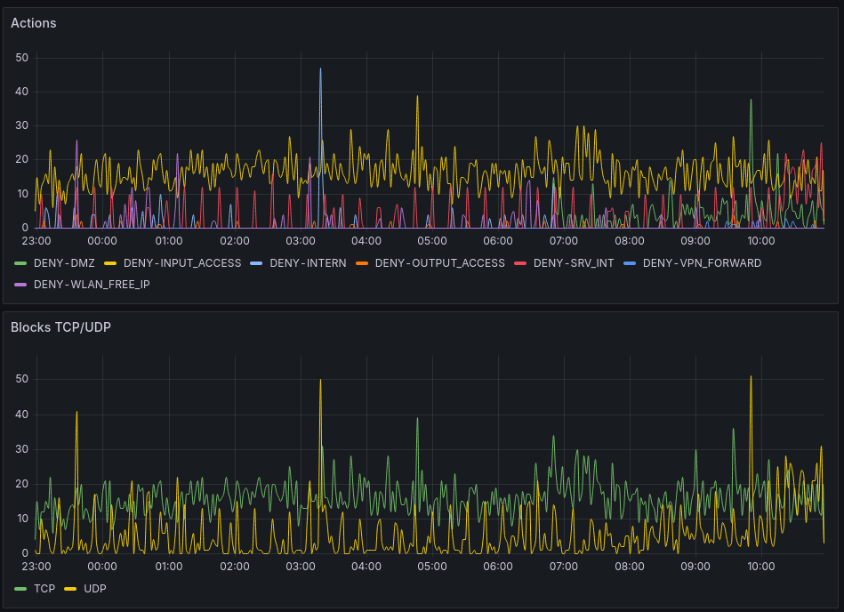
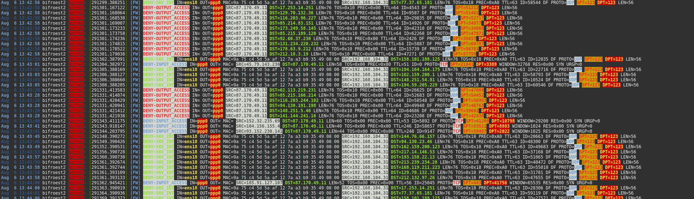

# 🛡️ bifroest – A modular firewall script for iptables

Automatically translated with deepl.com

bifroest2 is a robust, easy-to-understand and modular firewall framework based on iptables. It is aimed at administrators and power users who need clear, comprehensible rules for IPv4 networks – without black boxes and without complex tools such as firewalld or nftables. ‘What You See Is What You Get’ – WYSIWYG – without any additional bells and whistles, just a simple firewall. ;o)

I have been using the script since 2006 on a wide variety of systems and at many companies with many administrators. So far, everyone has been able to familiarise themselves with the structure and functionality without any problems, as all firewall rules are clearly laid out and nothing distracts from them. It is clear to see which rule has which task to perform. It is simply a firewall, without any distractions from the essentials.

---

## 🔍 Why bifroest2?

- ✅ **Modular structure** – Rules in separate, easy-to-maintain shell scripts (`rules-enabled/*.sh`)
- 🔄 **Fault tolerant** – syntax errors in individual rule files do not prevent other rules from loading
- 🔒 **Secure against lockouts** – no adoption of faulty rules
- 🧱 **Structured chains per object/zone** – e.g. `ALEX`, `GAST`, `IOT`
- 📜 **Readable logging** and clear separation of rule type & target system
- 🧠 **Easy to understand** – ideal for learning or for productive use in small to medium-sized networks. But it can also be used on a large scale!
- 📊 **Graphical evaluation** – Influxdb2 and Grafana evaluate for you and display recent events
- 🖧 **Internet router** – Routing from and to the Internet with simple rules
- 🖥️ **Web server** – Perfectly secures your web or any other server (prevents DDOS, flooding, etc.)

---

## 📦 Basic structure

```bash.

├── setup             # Script files for Grafana and Co.
├── main/
│   ├── init.sh       # Sets interfaces, defaults, prepares iptables
│   └── end.sh       # Processes rule arrays, ends script
├── rules-enabled/
│   ├── 01-alex.sh    # Rule for Alex's devices
│   ├── 02-iot.sh     # Rule for IoT network
│   ├── 98-input.sh   # main rule
│   ├── 99-output.sh  # main rule
│   ├── 99-spezial.sh # main rule
│   └── ...           # Additional object-based rule files
├── firewall.sh       # Starts the entire rule setup
└── README.md
```

---

## 🚀 Quick start

```bash
git clone https://github.com/Wutze/bifroest2.git
cd bifroest2
bash ./setup.firewall.sh
sudo ./firewall.sh start
```

**Note:** `iptables` must be installed and active beforehand. The system should be **IPv4-only** and `nftables` must be disabled. (`systemctl disable nftables`) The script was tested with its new release as bifroest2 on a bare Debian 12 with 2 network cards.

---

## ✍️ Beispiel-Regeldatei: `rules-enabled/01-alex.sh`

```bash
rulename="ALEX"
count=$(( $count + 1 ))
forwardrule[$count]="$rulename"

$FW -N $rulename

current_object_s[$count]="10.10.10.0/24"
current_object_d[$count]="0.0.0.0/0"

$FW -A $rulename -i $DEV_INTERN -o $DEV_EXTERN -s 10.10.10.61 -p tcp --dport 80 -j ACCEPT

# $FW -> as specified in firewall.conf - iptables
# -A -> assign to rule set
# $rulename -> name of the rule set, which must be specified in the file (here ‘Alex’)
# -i -> input device
# $DEV_INTERN -> as specified in firewall.conf, the internal network device
# -o -> output device
# $DEV_EXTERN -> the network device on which the data is to be sent (usually ppp0)
# -s -> Source, i.e. ‘where do the packets come from’
# 10.10.10.61 -> where exactly do the packets come from, here the IP address
# -p -> Protocol, TCP or UDP
# tcp -> see line above
# --dport -> The destination port
# 80 -> Port 80 is specified as the destination port, i.e. access to a web server without SSL
# -j ACCEPT -> Accept this rule exactly as it is. Instead of ACCEPT, DROP can also be entered, which would block communication with all web servers specifically for this purpose

# Further specific rules for DNS, ICMP, etc.
```

---

## 📚 Notes

- **No fixed includes necessary** – rules are loaded dynamically with Bash
- **Only valid rules are processed**, others are skipped
- Scripts are clearly documented and easy to understand
- The ‘setup.firewall.sh’ script automatically sets up all variables so that only the internal device is accessible via SSH! Provided you specify the correct network interfaces during setup. At least two network cards are required. The script also allows for much more. You can also create several different variables for the same network interface.

Example:

eth1 can be $DEV_INTERN, but also $DEV_VLAN, $DEV_INPUT, etc. This allows you to create new variables that always describe what task they are supposed to perform. This makes it easier to find errors or understand the contents of the files in complex firewalls.

---

## ❤️ Licence & Participation

`bifroest2` is licensed under the [EUPL](LICENSE). Pull requests and feedback are welcome!

## Installation

It is best to copy the firewall script to ``` /opt/firewall/ ```

git clone

```
cd /opt/
git clone https://github.com/Wutze/bifroest2
cd bifroest2

```

### Configuration

After setup, you will find the configuration in ``` firewall.conf ```

- ``` firewall.conf ```
Not everyone will have so many interfaces on their router. Therefore, you can delete the corresponding and unused variables; they are not absolutely necessary if the interfaces are not available. They are only used here as examples.

```
## Everything open or everything closed by default?!
DEFAULT_STATUS="DROP" 
#DEFAULT_STATUS=‘ACCEPT’ 

## Define interfaces 
DEV_INTERN="eth1" 
DEV_EXTERN="ppp0" 
```

The networks, ports, etc. specified below are often only of interest if you have a large number of clients in your own network. The names of the variables can also be adapted so that you can develop your own naming conventions that are easy to remember.

### Using the firewall, starting, stopping, etc.

- The help text is displayed when you enter ``` ./firewall help ``` .
- The firewall itself can then be started or stopped with ``` ./firewall start ``` or ``` ./firewall stop ``` .
- ``` ./firewall backup ``` creates a backup of the currently functioning firewall to ``` /tmp/ ```
- ``` ./firewall restore ``` restores the backup. If the firewall was not active before, it will be after the restore.
- ``` ./firewall debug 1 ``` enables extended logging in ``` /var/log/syslog ```. Normally, the entries made by the firewall are limited to 3 messages, otherwise the log file would become too large.
- ``` ./firewall debug 0 ``` returns logging to its normal state.

### Note

For simplicity's sake, the firewall rules are completely deleted and rebuilt with each function call. If someone wants to log access to various rules, e.g. with collectd, this will not work without further ado. That is why we use influxdb2 and Grafana.

## Important rule sets and creating new rules

### Default Rulesets

The default rulesets can be found as links in the rules-enabled folder. They are labelled ``` 98-input.sh ``` and  ``` 99-output.sh ``` and must not be deleted. The numbers before the links to the file names are necessary and are processed in exactly this order. No files with numbers above 98 should be created. Unless you know exactly what you are doing. In addition, these two rulesets are entered directly into the firewall, as they are only for OUTPUT and INPUT on the router. All other rules define the other files that regulate access by network clients.

The input.sh file provided here allows all communication from the internal networks with the router. You must therefore adjust it so that only the communication that is actually permitted is allowed. Remember, most hacker attacks usually happen from the internal network!

The output.sh is a little more finely tuned here. It defines where the router delivers responses and what communication it is allowed to establish itself.

This should clarify the rules for the router.

### Network rulesets

There are some sample rulesets in ``` rules-available/ ``` . Each one shows different variations and should therefore be self-explanatory.

## Debugging

There are two different debugging solutions.

1. Debugging the rulesets
2. Debugging the firewall script

### Debug Rulesets

Debugging of the rulesets can be controlled in firewall.conf. The variable ``` DEBUG_FW=1 ``` enables debugging and displays every rule case that does not meet the conditions you have set. If you have disabled debugging by default, which is advisable as otherwise the syslog file can become very full, you can enable logging with ``` /opt/firewall/firewall debug 1 ``` and disable it again with ‘0’.

### Script debugging

With ``` DEBUG=1 /opt/firewall/firewall [Options] ``` , script debugging is enabled. Here you can identify possible (typing) errors in your rule sets.

## Enable rules

The links must have the extension ``` sh ``` , otherwise they will not be automatically read and activated!

``` ln -s /opt/firewall/rules-available/ [ Dateiname.sh ] /opt/firewall/rules-enable/ [dateiname.sh] ```

## ‘Hidden’ settings

The following lines are located in ```/main/ende.sh```:

```
# TCP SYN-Flood-Schutz
$FW -A FORWARD -i $DEV_EXTERN -p tcp --syn -m connlimit --connlimit-above 20 -j DROP
$FW -A FORWARD -i $DEV_EXTERN -p tcp --syn -m limit --limit 4/s --limit-burst 10 -j ACCEPT
$FW -A FORWARD -i $DEV_EXTERN -p tcp --syn -j LOG --log-prefix "[FW] DROP-SYN-FLOOD "

# TCP RST-Flood-Schutz
$FW -A FORWARD -i $DEV_EXTERN -p tcp --tcp-flags RST RST -m limit --limit 4/s --limit-burst 10 -j ACCEPT
$FW -A FORWARD -i $DEV_EXTERN -p tcp --tcp-flags RST RST -j DROP
$FW -A FORWARD -i $DEV_EXTERN -p tcp --tcp-flags RST RST -j LOG --log-prefix "[FW] DROP-RST-FLOOD "

# ICMP Echo-Flood-Schutz
$FW -A FORWARD -i $DEV_EXTERN -p icmp --icmp-type echo-request -m limit --limit 4/s --limit-burst 10 -j ACCEPT
$FW -A FORWARD -i $DEV_EXTERN -p icmp --icmp-type echo-request -j DROP
$FW -A FORWARD -i $DEV_EXTERN -p icmp --icmp-type echo-request -j LOG --log-prefix "[FW] DROP-ICMP-FLOOD "
```

**Explanation: You can change these values, but you should know exactly what you are doing.**

-m limit --limit 4/s --limit-burst 10

→ This is a rate limiter to limit too many of these packets:

- max. 4 packets per second allowed
- up to 10 packets ‘burst’ (in a short time) allowed before the rate limiting limit takes effect

-j ACCEPT

→ Packets that meet the conditions and are below the limit are allowed through.

This is useful for:

- not blocking normal TCP behaviour (e.g. connection interruptions)
- but preventing abuse (e.g. in RST flood attacks)

**first line conlimit**

- syn → Only new connections (SYN packets, the first step in the TCP handshake).
- -m connlimit → Uses the connlimit module to count connections per source IP.
- connlimit-above 20 → If a source IP establishes more than 20 simultaneous connections...

Protection against connection floods from a single IP
→ e.g. bots, scanners or attackers that establish many parallel connections.

## Snippets

In the snippets folder:

1. Assuming you have Multitail installed, paste the lines from multitail.conf into the file /etc/multitail.conf. By calling: ``` multitail -s 2 -cS microwall /var/log/syslog ``` you will then have a colour-coded output that makes it easier to find errors.

2. A start/stop script for ``` /etc/init.d/ ```, just copy it in there. Done

3. Another function has been added to the firewall script. You can now write the firewall log to an influxdb2 to make the traffic on the router visible. You can find out more [here](snippets/influxdb/readme.md).

## Images





## Wishes/Future

There are still many possibilities to expand the whole set. Some things will certainly become apparent when the firewall script is started without parameters. In particular, it would be nice if I could automate the ```enable/disable [rulename]``` function at some point. ;o)

There are other ideas on how to make the whole thing even more convenient, whether it be evaluation or status displays, etc. Let's see where the journey takes us.
